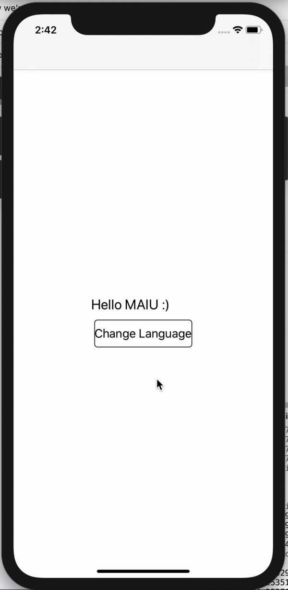
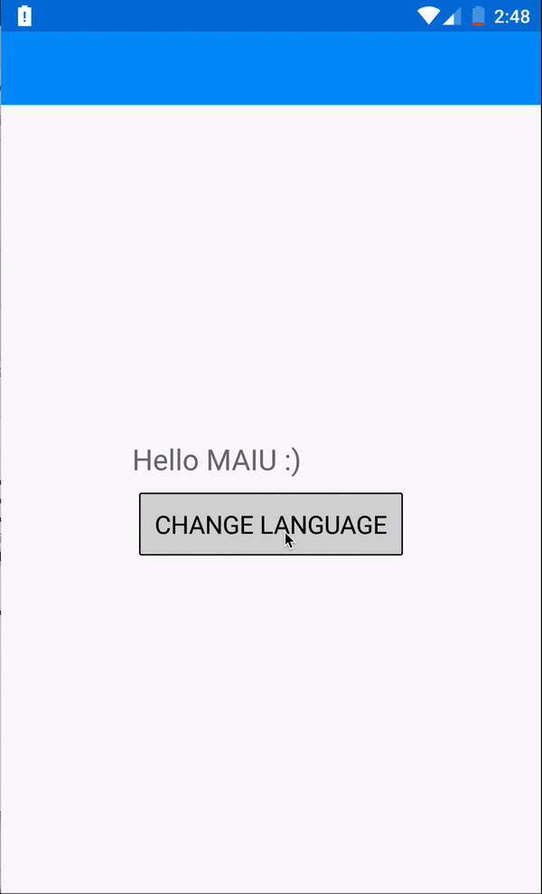

# Mastering Multilingual in Xamarin Forms 

&nbsp;&nbsp;&nbsp;&nbsp;&nbsp;&nbsp;&nbsp;

This sample covers: 
- Updating Language in Runtime
- Platform controls localizations in RunTime
- Using localized c# Texts
- Remind the latest language when closing the app
- Small text modifications